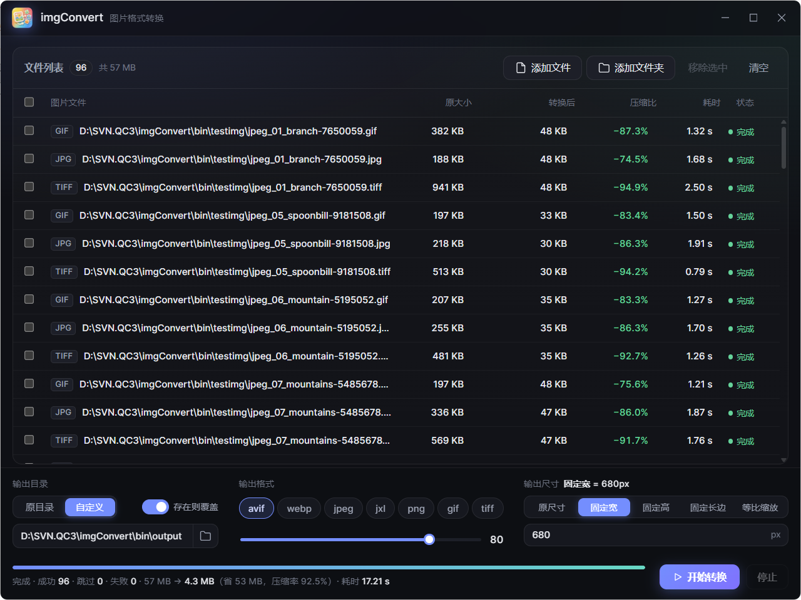

# imgConvert · 极速图片批量格式转换



桌面端图片批量转换工具。把图片或整个文件夹拖进来，选好格式，一键转换——**快到飞起，压缩狠质量又看不出差别**。

🌐 官方网站：[https://imgconvert.bossbbs.com/](https://imgconvert.bossbbs.com/)

---

## 为什么用 imgConvert

- **极速**：单图转换以毫秒计；自动并发占满所有 CPU 核心，几百张图批量处理也不卡。
- **批量无压力**：直接拖入文件或整个文件夹，自动递归扫描子目录。
- **绝不丢文件**：输出**严格按原目录结构**落盘，不同子文件夹里的同名图片各归各位，互不覆盖。
- **智能压缩**：质量滑块 0–100，各格式预置了「肉眼基本无差」的默认档，闭眼用也不会压成马赛克。
- **断点续转**：已转换成功的输出默认自动跳过，中断后重跑只补未完成的；随时可取消。
- **所见即所得**：每个文件实时显示原大小、输出大小、压缩率与耗时，结果透明可控。

---

## 功能一览

- 拖拽添加文件 / 文件夹（含多层子目录）
- 输出格式：**AVIF · WebP · JPEG · JXL · PNG · GIF · TIFF**
- 输入格式：**JPEG · PNG · WebP · AVIF · JXL · TIFF · GIF · BMP · HEIC / HEIF**
- 质量调节（等效 JPEG 质量刻度，按格式自动校准）
- 尺寸变换：原尺寸 / 固定宽 / 固定高 / 固定长边 / 等比百分比
- 输出位置：原目录（同目录）或自定义目录（保留目录结构）
- 「存在则覆盖」开关，便于重跑或原地重编码
- 转换日志，方便事后核对与排查
- 转换进度、成功 / 跳过 / 失败统计一目了然

---

## 三步上手

1. 把图片或文件夹**拖进窗口**（也可点按钮选择）。
2. 选好**输出格式、质量、尺寸**。
3. 点 **开始转换**，进度与结果实时呈现。

---

## 下载与安装

### 方式一：直接下载（推荐）

- GitHub [Releases](https://github.com/yl365/imgConvert/releases) 页面：下载对应平台的可执行文件，双击即可运行，无需安装。
- 百度网盘（Windows 版备用下载）：

  ```
  链接：https://pan.baidu.com/s/1gtVF8Z1v_0zyfmudh6LSaw?pwd=9e84
  提取码：9e84
  ```

> 当前主要提供 Windows 版本；macOS / Linux 可从源码构建。

### 方式二：从源码构建

需要：Go 1.25+、Node.js、[Wails v3](https://v3.wails.io/) CLI。

```bash
# 克隆仓库
git clone https://github.com/yl365/imgConvert.git
cd imgConvert

# 开发预览（热重载）
wails3 dev

# 构建生产可执行文件（输出到 build/ 目录）
wails3 build
```

---

## 使用小贴士

- **想压到最小**：优先选 AVIF 或 WebP，质量 60–80 通常就能兼顾体积与画质。
- **要无损**：选 PNG / JXL / TIFF，图标、截图、存档场景最稳。
- **需要兼容老设备**：JPEG 通用性最好，但不支持透明。
- **大批量中断了？** 不用删已转换的文件，直接再跑一次，已存在的会自动跳过。

---

## 技术栈

- 后端：Go + libvips（通过 CLI 驱动）
- 前端：原生 HTML / CSS / JavaScript
- 框架：[Wails v3](https://v3.wails.io/)（用 Web 技术打包原生桌面应用，体积小、启动快）
- 平台：Windows / macOS / Linux

---

## License

本项目以 MIT License 开源，详见 [LICENSE](LICENSE)。
